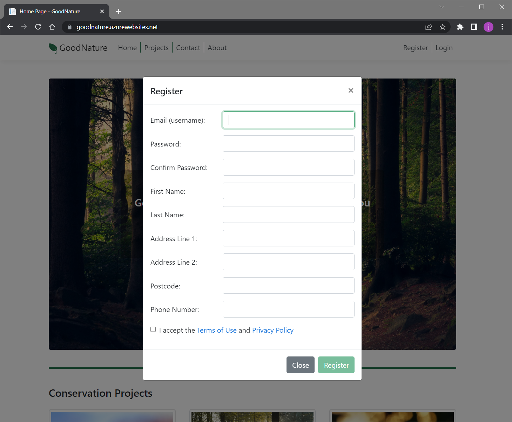
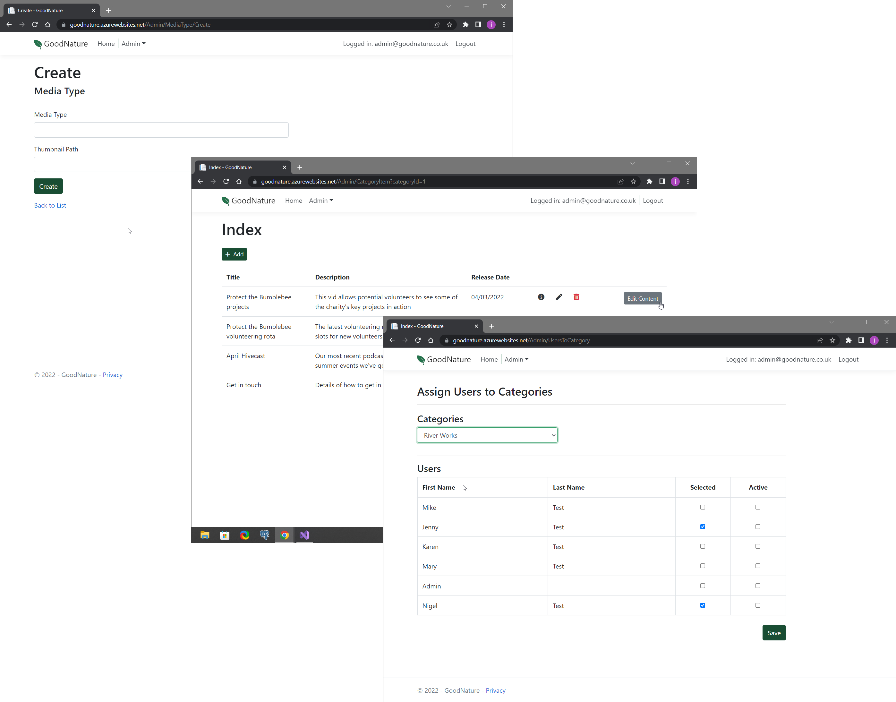

Good Nature is a conservation app created with ASP.NET Core MVC. 
It provides users with information about projects with volunteering opportunities 
and lets them shortlist and select those that interest them. 
The app can be used on a variety of screen sizes.

## Current Features

The features implemented so far are described below.

### Unregistered Users

There are currently three user types: unregistered, registered, and admin.

Unregistered users (and those not currently logged in) see a homepage with
several sections. 

There is a hero image and a registration link at the top.

Beneath the hero image, there is a set of cards representing the different conservation projects:

And towards the bottom there are *Contact Us* and *About Us* sections: 

### Registering

Volunteers can register by clicking the button in the center of the hero image. 
They are also able to register via one of the conservation project cards. 
If the latter option is chosen, the project described in the card will automatically 
be added to the user's shortlist (more on this later).

### Registered Users

Registered users gain access by clicking the *Login* navbar option and entering their details:

Once logged in, users see a different homepage containing the projects they have shortlisted 
and applied to volunteer with. These are formatted as collapsible lists:

Clicking a list item displays the relevant content:

Clicking the *Choose Projects* button near the top right of the homepage takes the user
to a page where they can manage their projects. Checkboxes are used to shortlist or apply
to volunteer with projects. And after saving, the user is returned to the homepage, 
where any changes are reflected.

### Admin User

The admin user has access to an additional dropdown menu that allows configuration
and management of the system:

The pages that can be accessed through this menu allow the administrator to complete tasks
such as:

- Defining which media types can be used. 
- Adding and editing new projects and content items. 
- Specifying the relationships between users and projects.

## Next Steps

A few of the features that could be added following feedback are listed below:

- Create a project selection tool to help volunteers find projects that match their 
interests, skills, and availability.
- Add a project admin user type so projects can manage their own content 
and directly view the details of people who have applied to volunteer with them.
- Create a notification system to automatically alert projects when somebody applies to volunteer.

~Images and vectors courtesy of Unsplash, Stockio.com, and Robert Bjurshagen from Noun Project.~