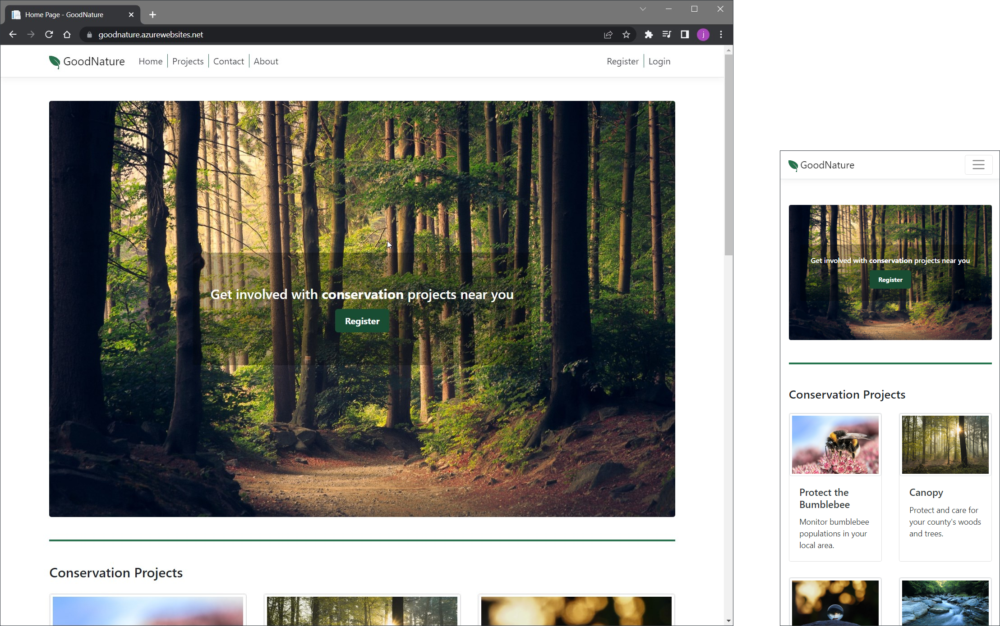

Good Nature is a conservation app created with ASP.NET Core MVC. It provides potential volunteers
with information about a variety of projects and lets them shortlist and select those they would 
like to work with.

The features implemented so far are described below.

## Unregistered Users

There are currently three types of user: unregistered, registered, and admin.

Unregistered users (and those not currently logged in) see a homepage with
several sections. 

At the top is a hero image and registration link.

Beneath the hero image there is a set cards of representing the different conservation projects:

And towards the bottom there are *Contact Us* and *About Us* sections: 

## Registering

Volunteers can register by clicking the register button in the center of the hero image. They can
also register via one of the conservation project cards. If the latter option is chosen,
the project described in the card will be automatically added to the users shortlist (more on this later).

## Registered Users

Registered users can click the *Login* navbar option to select projects and view project files:

Once logged in, users see a different homepage that contains the projects they have
shortlisted and applied to volunteer with. These are formatted as a collapsible list:

And clicking an item displays the relevant content:

Clicking the *Choose Projects* button near the top right of the homepage takes the user
to a page where they can manage their projects. Checkboxes are used to shortlist or apply
to volunteer with projects. And once the *Save* button has been clicked, the user is
returned to the homepage where any changes are reflected.

