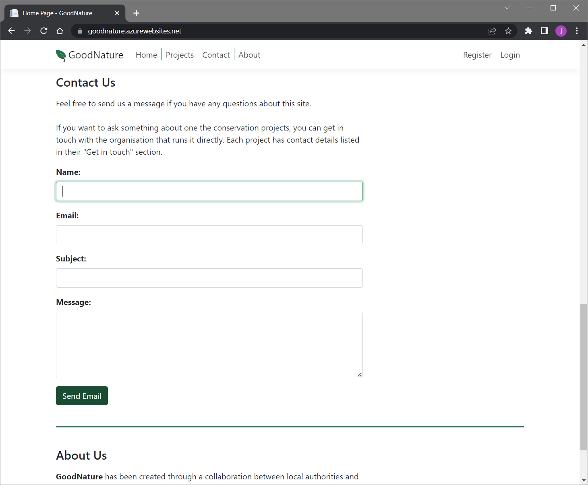

Good Nature is a conservation app created with ASP.NET Core MVC. It provides potential volunteers
with information about a variety of projects and lets them shortlist and select those they would 
like to work with.

The features implemented so far are described below.

## Unregistered Users

There are currently three types of user: unregistered, registered, and admin.

Unregistered users (and those not currently logged in) see a homepage with
several sections. 

At the top is a hero image and registration link.

Beneath the hero image there is a set cards of representing the different conservation projects:

And towards the bottom there are *Contact Us* and *About Us* sections. 

